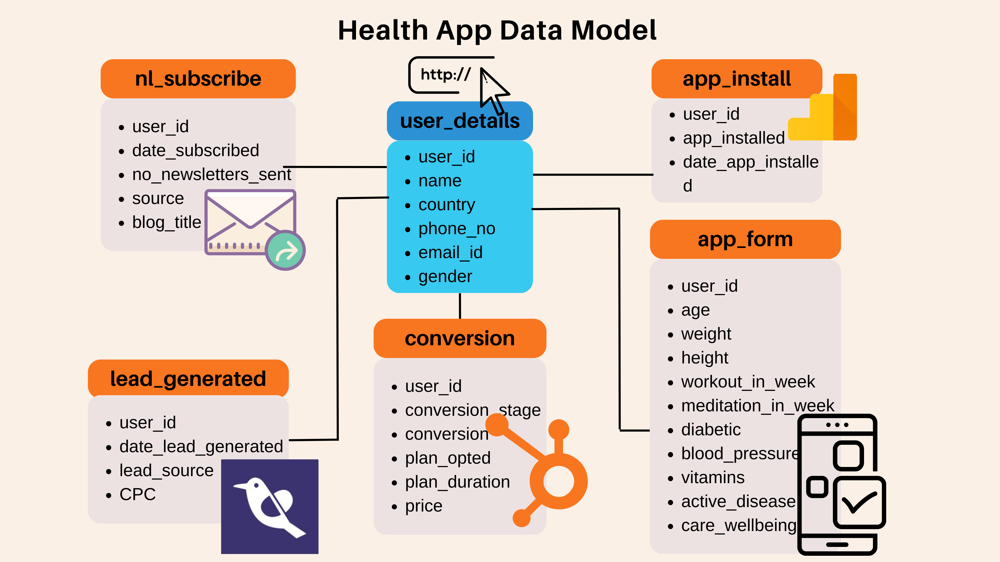

# We have 6 data sources here with the 'user_details' table as a fact table and the other 5 as a dimensional table. 
# We will be using BigQuery as a Datawarehouse.

# We will run a primary analysis to understand the data, utilizing SQL in BigQuery.

# Next, We will join the data and proceed to EDA and Cluster Analysis.
<a href="https://github.com/swa28/Health_app_data_workflow/blob/main/health_app_data_EDA.ipynb" target="_blank">Click here to visit EDA notebook</a>

<a href="https://github.com/swa28/Health_app_data_workflow/blob/main/health_app_data_EDA.ipynb" target="_blank">Click here to visit Cluster Analysis notebook</a>

# Now, let's build a dashboard to analyse the overall performance of the workflow.
<a href="https://public.tableau.com/app/profile/swanand.marathe/viz/HealthAppUserWorkflowAnalysis/Dashboard1" target="_blank">Click here to visit Tableau Dashboard</a>

## Following are the queries ran and respective results from in BigQuery.

## How many users's details do we have with us?
<pre>
SELECT COUNT(*) 
FROM health-app-project-423804.health_app_data.user_details ud;
</pre>

## In how many countires we a User presence?
<pre>
SELECT COUNT(DISTINCT country)
FROM health-app-project-423804.health_app_data.user_details;
</pre>

## What is the Gender distribution among users?
<pre>
SELECT gender, COUNT(*) AS count 
FROM health-app-project-423804.health_app_data.user_details
GROUP BY gender;
</pre>

## How many people subscribed for newsletter?
<pre>
SELECT COUNT(*)
FROM health-app-project-423804.health_app_data.nl_subscribers nls;
</pre>

## What where the different traffic source and their share to total?
<pre>
SELECT source, COUNT(source) AS users_per_source, ROUND((COUNT(source)*100)/(SELECT COUNT(*) FROM health-app-project-423804.health_app_data.nl_subscribers),2) AS percentage_share
FROM health-app-project-423804.health_app_data.nl_subscribers nls
GROUP BY 1
ORDER BY 2;
</pre>

## How does our overall funnel looks like? 
<pre>
WITH funnel AS (
  SELECT * 
  FROM health-app-project-423804.health_app_data.nl_subscribers nls
  FULL OUTER JOIN health-app-project-423804.health_app_data.app_downloaders ad
  ON nls.user_id = ad.user_id
  FULL OUTER JOIN health-app-project-423804.health_app_data.lead_generated lg
  ON nls.user_id = lg.user_id
  FULL OUTER JOIN health-app-project-423804.health_app_data.conversions c
  ON nls.user_id = c. user_id
)
SELECT COUNT(funnel.date_subscribed) AS newsletter_subscribers, COUNT(funnel.app_installed) AS app_downloaders, COUNT(funnel.lead_source) AS trial_opted_by, COUNT(funnel.conversion) AS plan_subscribers
FROM funnel;
</pre>

## How many average days does a user take moving from one stage to another stage of funnel? 
<pre>
WITH funnel_time AS(
  SELECT * 
  FROM health-app-project-423804.health_app_data.nl_subscribers nls
  JOIN health-app-project-423804.health_app_data.app_downloaders ad
  ON nls.user_id = ad.user_id
  JOIN health-app-project-423804.health_app_data.lead_generated lg
  ON nls.user_id = lg.user_id
  JOIN health-app-project-423804.health_app_data.conversions c
  ON nls.user_id = c. user_id 
)
SELECT ROUND(AVG(DATE_DIFF(f.date_app_installed, f.date_subscribed, DAY)),2) AS avg_days_for_app_download,
  ROUND(AVG(DATE_DIFF(f.date_lead_generated, f.date_app_installed, DAY)),2) AS avg_days_to_opt_trial,
  ROUND(AVG(DATE_DIFF(f.conversion_stage, f.date_lead_generated, DAY)),2) AS avg_days_to_subscribe_plan
FROM funnel_time f;
</pre>

## Lets have a look at BMI of our users and count per category?
<pre>
WITH bmi_calculations AS (
  SELECT user_id, ROUND(((weight / height) / height) * 10000, 2) AS bmi,
    CASE
      WHEN ROUND(((weight / height) / height) * 10000, 2) < 18.5 THEN 'Underweight'
      WHEN ROUND(((weight / height) / height) * 10000, 2) BETWEEN 18.5 AND 24.9 THEN 'Normal weight'
      WHEN ROUND(((weight / height) / height) * 10000, 2) BETWEEN 25 AND 29.9 THEN 'Overweight'
      WHEN ROUND(((weight / height) / height) * 10000, 2) >= 30 THEN 'Obesity'
    END AS bmi_category
  FROM health-app-project-423804.health_app_data.app_form_details
)

SELECT bmi_category, COUNT(*) AS count
FROM bmi_calculations
WHERE bmi_category IS NOT NULL
GROUP BY 1
ORDER BY 2 DESC;
</pre>

## What is the overall cost of campaigning by each platform? and Running total over platforms.
<pre>
WITH platform_cost AS (
  SELECT lead_source, ROUND(SUM(CPC),2) AS total_cost
  FROM 
    `health-app-project-423804.health_app_data.lead_generated`
  GROUP BY lead_source
)
  SELECT lead_source, total_cost,
  ROUND(SUM(total_cost) OVER (ORDER BY lead_source),2) AS running_total
  FROM platform_cost
  GROUP BY 1, 2;
</pre>

## What is the total revenue for each plan each duration?
<pre>
SELECT plan_opted AS plan, plan_duration AS plan_duration, COUNT(*) AS purchase_count, SUM(price)
FROM health-app-project-423804.health_app_data.conversions
GROUP BY 1,2
ORDER BY 4;
</pre>

